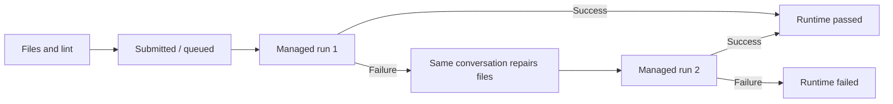

# WaveBench Architecture

The CLI in `wavebench/__main__.py` loads models, configuration and prompt history,
then dispatches to `core.orchestrator.main_async`. The orchestrator owns output
allocation, the progress display, scheduling, final results, and history.

## Harness flow



`HarnessSession` owns the conversation, budgets, phase transitions and attempt
list in controller memory. `HarnessBatch` coordinates initial builds. In
`after_all`, every initial build settles before execution tasks begin; failed,
cancelled, unsupported, and exhausted builds all release the barrier. Other
settings schedule immediately. API slots are held only for requests, so queued
projects cannot deadlock the barrier. Repairs do not use a second barrier.

The only attempt admission site is `HarnessSession.execute`, guarded by an
execution lock and a once-only flag. Preflight/setup happens before admission;
a counted attempt includes failed process creation. The loop can admit only
runs 1 and 2, and it enters repair only after run 1 fails. Lint has no path to
attempt admission. Duplicate delivery cannot replay completed file effects or
restart execution. Cancellation settles file operations, stops all managed
processes, and preserves the workspace and diagnostics.

`transport.py` uses the existing OpenRouter API URL, catalog, reasoning settings,
and retry policy from `api.py`. It assembles indexed tool calls and reasoning
fields across complete UTF-8 SSE fragments. Only a finished, valid turn reaches
`Dispatcher.batch`; results use the OpenRouter assistant/tool-call/tool-result
conversation format, with the schema on every request. HTTP retries occur before
side effects. Context and total-token admission include the whole conversation.
Actual model/provider, usage, reasoning/context adjustments, and transport retry
events are saved per turn.

`Dispatcher` is shared with the `wb` CLI and has no shell evaluator. Its bounded
scheduler overlaps independent calls, serializes conflicting paths, and puts
lint behind writes. The root is fixed in `Workspace`, whose operations use
`dir_fd`, `O_NOFOLLOW`, regular-file checks, and atomic replacement. Invocation
and model directory creation is exclusive, including sanitized-name collisions.

`Runtime` launches Bubblewrap with a minimal filesystem, private PID/network
namespaces, no host environment or credentials, and read-only system tools.
`trusted.py` is mounted read-only and provides static checks, Python/Node entry
launching, static serving, and a Unix-socket HTTP relay. Project and runtime data
are confined to that model's workspace. Trusted wheel-only pip setup is the only
sandbox action allowed networking. Dependencies never share writable targets.
The controller drains bounded stdout/stderr, enforces deadlines, and stops the
process group and namespace before repair or review completion.

Console programs pass on exit 0. HTTP/static projects pass on bounded readiness;
these are startup checks, separate from quality. The controller presents the
existing server through a loopback proxy. Preview opening has no launch path.
Supported environments, CLI syntax, limits and dependency restrictions are in
[`harness.md`](harness.md).

## Other modes and persistence

Text/TTS/image retain `core.runner.run_model`: stream or request the response,
parse/save its artifacts, then use the existing viewer/audio/gallery behavior.
`parsers.py` and the compatibility `CodeMode.parse_response` still read old
single-file code artifacts. Harness is visible in the registry and selector;
`code` remains a CLI alias.

`storage.record_run` preserves detailed harness results alongside old records.
Each model also has controller-owned `metadata/result.json`, conversation and
tool records, and subprocess logs. Project roots never contain history,
attempts, or controller configuration. Timing separates build, API/tools,
scheduler wait, setup, execution and repair. `time_s` measures active build plus
repair; lifetime analytics distinguish harness rows and include known failed-run
costs. Unknown usage/cost remains unknown.

## Public seams and import compatibility

The package intentionally re-exports common entry points from package
`__init__.py` files:

| Import | Provided by |
|---|---|
| `from wavebench.core import main_async` | `wavebench/core/__init__.py` → `orchestrator.py` |
| `from wavebench.core import run_model, get_unique_filename` | `wavebench/core/__init__.py` → `runner.py` |
| `from wavebench.tui.progress import ProgressTracker, render_idle_wave` | `wavebench/tui/progress/__init__.py` |
| `from wavebench.tui.analytics import compute_cost, display_analytics` | `wavebench/tui/analytics/__init__.py` |
| `from wavebench.tui.menus import run_model_selection, run_config_menu` | `wavebench/tui/menus/__init__.py` |
| `from wavebench.modes import MODES, Mode, ParsedOutput` | `wavebench/modes/__init__.py` |

`tests/unit/test_public_api.py` is the contract test for these imports.

## Where to look for specific changes

| If you want to change… | Start here |
|---|---|
| CLI flags, startup mode selection, prompt history | `wavebench/__main__.py` |
| OpenRouter requests, reasoning/catalog, TTS/image | `wavebench/api.py` |
| Harness conversations, streamed tool arguments, provider fields | `wavebench/harness/transport.py` |
| Bounded file tools and developer CLI | `wavebench/harness/commands.py`, `workspace.py`, `__main__.py` |
| Sandbox, manifests, lint, managed previews | `wavebench/harness/runtime.py`, `trusted.py` |
| Build/repair budgets, scheduling, attempt admission | `wavebench/harness/session.py` |
| Reasoning-effort payload formats and per-model effort mapping | `wavebench/api.py` (`_reasoning_attempts`, `_supported_efforts`) |
| Model catalog ranking, default text/TTS mappings, and TTS model/voice/format helpers | `wavebench/models.py` |
| Code extraction from model responses | `wavebench/parsers.py` and `wavebench/modes/code.py` |
| Adding a new response mode | `wavebench/modes/` and the guide in `docs/CONTRIBUTING.md` |
| TTS output navigation/playback | `wavebench/tui/tts_player.py` |
| Benchmark fan-out, output directory setup, history recording | `wavebench/core/orchestrator.py` |
| Per-model file writing and parse-failure handling | `wavebench/core/runner.py` |
| Auto-open terminal/viewer behavior | `wavebench/core/auto_open.py` |
| Historical single-file dependency helpers | `wavebench/core/auto_install.py` |
| Live progress animation and model status display | `wavebench/tui/progress/tracker.py` and `wavebench/tui/progress/wave.py` |
| Lifetime analytics table | `wavebench/tui/analytics/table.py` |
| Cost calculation | `wavebench/tui/analytics/cost.py` |
| Model browser menu | `wavebench/tui/menus/model_list.py` |
| Tabbed configuration menu | `wavebench/tui/menus/config_menu.py` |
| Themes, colors, box drawing, width helpers | `wavebench/tui/styles.py` |
| Persistent state files | `wavebench/storage.py` |

## Modes

Modes are small value objects implementing `wavebench.modes.Mode`:

- `HarnessMode` (also exported as `CodeMode`) supplies the compact project prompt.
  The orchestrator selects a conversation/session lifecycle instead of response
  extraction. Its historical parser remains available for existing artifacts.
  Auto-install permits explicit PyPI wheel manifests in isolated targets.
- `TextMode` frames prompts for Markdown prose and saves the raw response as
  `.md`.
- `TTSMode` sends the user text to OpenRouter's `/audio/speech` endpoint,
  saves returned audio bytes with provider-compatible extensions (`.mp3` by default
  for OpenAI/Voxtral/Zonos and most speech models, `.pcm` for Gemini TTS), maps
  known non-OpenAI defaults to provider voices such as Gemini `Kore`, Zonos
  `american_female`, Voxtral `en_paul_neutral`, and Kokoro `af_alloy`, and plays
  saved outputs through the native TTS player without launching an external app.

A mode must provide:

```python
def frame_prompt(self, user_prompt: str) -> str: ...
def parse_response(self, raw: str) -> ParsedOutput: ...
```

Registered modes are available through `wavebench --mode <name>`. The current
interactive startup selector displays Harness/Text/TTS/Image explicitly; add key handling in
`__main__.py` if a new mode should appear there.

## Persistent state

WaveBench stores local state in the current working directory:

| File | Contents |
|---|---|
| `.benchmark_models.json` | selected `{short_name: openrouter_id}` mapping; TTS mode filters this to TTS-capable IDs and falls back to bundled TTS defaults if none are selected |
| `.benchmark_config.json` | `reasoning_effort`, `analytics_sort`, `theme`, `directory_naming`, `auto_open`, `auto_install`, `tts_voice`, `tts_format`, `tts_speed` |
| `.benchmark_history.json` | `{version: 1, runs: [...]}` analytics history |
| `.benchmark_query_history.<mode>` | mode-specific prompt-entry history for the interactive editor (`code`, `text`, `tts`, `image`) |

For backward compatibility, Harness uses `.benchmark_query_history.code` and
also reads the legacy `.benchmark_query_history` fallback. No historical files
are rewritten. Harness records contain a versioned `harness` object; analytics
show them in separate model rows from one-shot history.

Persistent-state path helpers call `os.getcwd()` at use time. This keeps
tests easy to isolate with `monkeypatch.chdir(tmp_path)` and gives each project
directory its own WaveBench state, but it also means running from a different
directory uses different settings/history.

## Testing tiers

| Tier | Location | Purpose |
|---|---|---|
| Unit | `tests/unit/` | Pure functions, mode behavior, storage round-trips, public imports |
| Integration | `tests/integration/` | Mocked OpenRouter/SSE behavior through real API-client code paths. One exception: `test_directory_naming_live.py` makes a real OpenRouter call; it is marked `slow`, deselected by default, and runs only via `pytest -m slow` |
| Characterization | `tests/characterization/` | Contract tests around refactor-sensitive seams such as core, menus, and progress |

Fixtures in `tests/conftest.py`:

- `tmp_state_dir` — changes CWD to a temporary directory for state-file tests.
- `isolated_env` — removes `OPENROUTER_API_KEY` from the environment.

Use pytest's built-in `capsys`, `monkeypatch`, and `tmp_path` for output,
patching, and temporary files.

This architecture document is the authoritative map of the current codebase.
