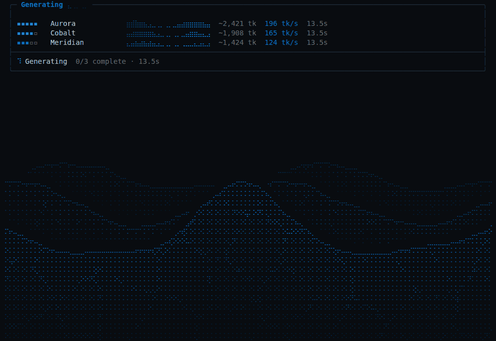

# Wave animation preview

The water carries a deforming caustic tessellation with hairline highlights and fine CRT scanlines. Its height, brightness, and motion build as output arrives.

This recording shows the actual terminal progress display in the Blueberry theme, using simulated streaming updates.
